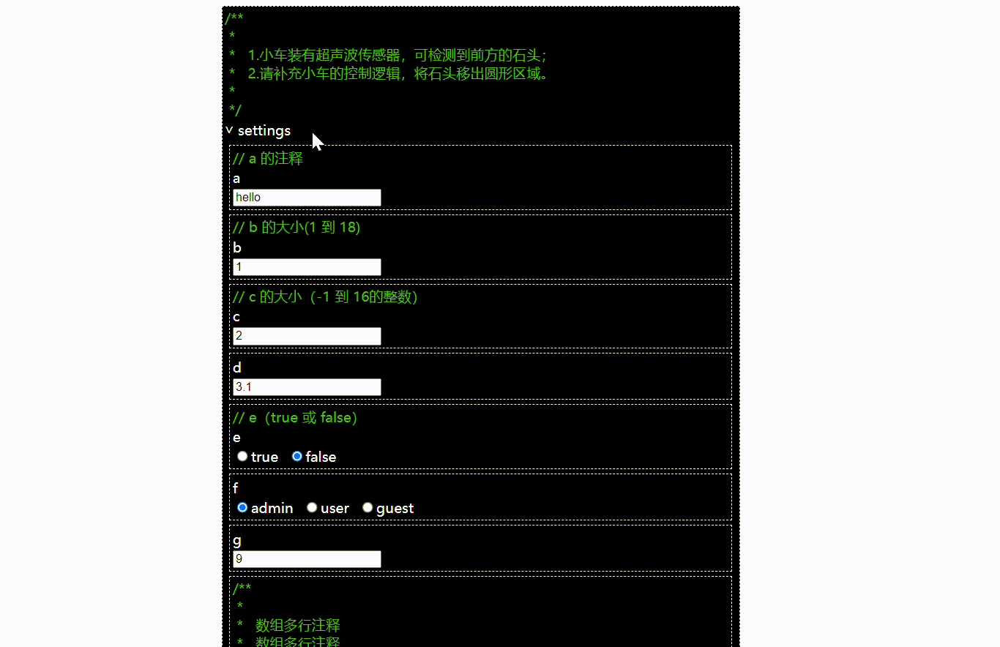

<p align="center">
  <a href="https://github.com/upqingup/form-cross-view">
    
  </a>
</p>

<h1 align= "center">
  <a href="https://github.com/upqingup/form-cross-view" target="_blank">form-cross-view</a>
</h1>

<!-- <p align="center">
  <a href="https://github.com/upqingup/form-cross-view/blob/main/LICENSE">
    
  </a>
  <a href="https://github.com/upqingup/form-cross-view/issues">
    
  </a>
</p> -->

<strong>form-cross-view 是一个跨视图动态表单生成框架，它是基于并扩展了 [async-validator](https://github.com/yiminghe/async-validator) 数据描述规范， 分离了表单逻辑与视图，支持自定义基于不同业务框架、UI 组件库的视图。

你可能出于以下原因选择 form-cross-view，当然前提是你需要一个表单生成组件：
1. 你需要自定义表单视图，但又不想写表单逻辑（动态渲染、数据收集、数据验证等），一种场景是社区当前没有较好的表单生成方案适合你项目所使用的业务框架（如 Solid）、UI 组件库（如 Hope UI）；
2. 你不想写繁琐的 JSON Schema，并且在某些情况下，你需要自定义单个字段的同步或异步校验逻辑。

另外，form-cross-view 内置了一些视图组件，作为自定义视图的参考范例，包括原生 DOM、React、Solid、Vue，可开箱即用，但目前只支持部分简单字段类型。</strong>

## 演示
- 实现详见 [demos/solid](https://github.com/upqingup/form-cross-view/blob/master/demos/solid-demo/src/App.tsx)



## 目录
- [演示](#演示)
- [功能](#功能)
  - [包说明](#包说明)
- [上手指南](#上手指南)
  - [自定义表单视图](#自定义表单视图)
  - [使用内置视图组件](#使用内置视图组件)
- [贡献](#贡献)
  - [开发指南](#开发指南)
- [TODOS](#TODOS)
- [作者](#作者)
- [版权说明](#版权说明)

### 功能
- 基于并扩展 [async-validator](https://github.com/yiminghe/async-validator) 数据描述规范
  - 扩展字段描述：defaultValue、comment、editable、extendRules、name、unit ...
  - 扩展字段类型：正整数 ...
- 丰富的表单操作
  - 基本逻辑：嵌套结构、动态渲染、数据收集、数据验证、监听变化 ...
  - 字段操作：展开收起、编辑数组元素（增加、删除、移动、复制）...
- 通过定义待实现的视图接口，支持自定义不同业务框架、UI 组件库的视图
- 内置开箱即用的视图组件：原生 DOM、React、Vue、Solid ...

#### 包说明
| 包名 | 说明 |
| --- | --- |
| @form-cross-view/core [](https://www.npmjs.com/package/@form-cross-view/core) [](https://www.npmjs.com/package/@form-cross-view/core) | 处理核心表单逻辑，与框架无关 |
| @form-cross-view/native-view [](https://www.npmjs.com/package/@form-cross-view/native-view) [](https://www.npmjs.com/package/@form-cross-view/native-view) | 原生 DOM 视图组件，与框架无关 |
| @form-cross-view/react-view [](https://www.npmjs.com/package/@form-cross-view/react-view) [](https://www.npmjs.com/package/@form-cross-view/react-view) | React 视图组件，适用于 React 项目 |
| @form-cross-view/solid-view [](https://www.npmjs.com/package/@form-cross-view/solid-view) [](https://www.npmjs.com/package/@form-cross-view/solid-view) | Solid 视图组件，适用于 Solid 项目 |
| @form-cross-view/vue-view [](https://www.npmjs.com/package/@form-cross-view/vue-view) [](https://www.npmjs.com/package/@form-cross-view/vue-view) | Vue 视图组件，适用于 Vue 项目 |

### 上手指南

#### 自定义表单视图
##### 步骤一
安装 @form-cross-view/core
```shell
npm i -S @form-cross-view/core
```
##### 步骤二
实现 createViewReact 函数，用于生成每种字段的视图组件，示例为简单起见，只针对 2 种字段类型，分别是对象和字符串
- 关键是理解并实现 ViewCtx 上的接口
```ts
// import { ViewCtx } from '@form-cross-view/core';

export interface ViewCtx {
  syncChildren?: () => void; // 用于同步 controller children 到视图节点 children
  setValue?: (value: any) => void; // 用于设置显示的字段值
  setName?: (name: string) => void; // 用于设置显示的字段名
  setValueVisible?: (visible: boolean) => void; // 用于控制值是否显示（仅对对象、数组字段生效）
  setError?: (message?: string) => void; // 用于设置显示的字段错误
  [k: string]: any;
}
```
```tsx
import { FormField } from '@form-cross-view/core';
import classnames from 'classnames';

import styles from './index.module.scss';

interface Props { [ k: string]: any }

function createViewReact(controller: FormField) {
  // 字段容器组件
  const Container = (props: Props) => {
    return (
      <div className={styles.formField}>{props.children}</div>
    )
  }
  
  // 字段注释组件
  const Comment = (props: Props) => {
    return (
      <div className={styles.comment}>{props.comment}</div>
    )
  }
    
  // 字段名组件
  const Label = (props: Props) => {
    switch(controller.type) {
      case 'object': {
        return (
          <div className={styles.fieldName}>
            <span
              className={classnames({
                [styles.valueVisibleCtrl]: true,
                [styles.fold]: !props.valueVisible,
              })}
              onClick={() => controller.valueVisible = !controller.valueVisible }
            >
              {'>'}
            </span>
            <span>{props.name}</span>
          </div>
        )
      }
      default:
    }
    return (
      <div className={styles.fieldName}>
        {props.name}
      </div>
    )
  }
    
  // 字段值组件
  const Value = (props: Props) => {
    const value = controller.getValue();
    switch(controller.type) {
      case 'object': {
        return (
          <div
            className={classnames({
              [styles.fieldValue]: true,
              [styles.fold]: !props.valueVisible,
            })}
          >
            {props.children}
          </div>
        )
      }
      case 'string': {
        const [valueDisplay, setValueDisplay] = useState(value);
        
        // 这里实现 controller.viewCtx.setValue 接口，也就是从 Model => View
        controller.viewCtx.setValue = (value: string) => setValueDisplay(value);
        
        const onInput = async (e) => {
          const valueCur = String(e.target?.value);
          setValueDisplay(valueCur);
          
          // 这里调用 controller.onValueChange，也就是从 View => Model
          await controller.onValueChange({
            source: 'input',
            value: valueCur,
          });
        }
        return (
          <input className={styles.fieldValue} type={'text'} value={valueDisplay} onInput={onInput} />
        )
      }
      default:
    }
    const [valueDisplay, setValueDisplay] = useState(value);
    controller.viewCtx.setValue = (value: string) => setValueDisplay(value);
    return (
      <div className={styles.fieldValue}>{valueDisplay}</div>
    )
  }
  
  // 错误信息组件
  const ErrorView = (props: Props) => {
    return (
      <div
        className={classnames({
          [styles.error]: true,
          [styles.hidden]: !props.message,
        })}
      >
        {props.message}
      </div>
    )
  }
  
  // 将上述组件组合起来
  const NodeView = () => {      
    const [comment, setComment] = useState(controller.comment);
    
    const [name, setName] = useState(controller.name);
    // 这里实现 controller.viewCtx.setName 接口
    controller.viewCtx.setName = (name: string) => setName(name);

    const [valueVisible, setValueVisible] = useState(controller.valueVisible);
    // 这里实现 controller.viewCtx.setValueVisible 接口
    controller.viewCtx.setValueVisible = (visible: boolean) => setValueVisible(visible);

    const messageOrigin = controller.error?.map(e => e.message).join(';\n');
    const [message, setMessage] = useState(messageOrigin);
    // 这里实现 controller.viewCtx.setError 接口
    controller.viewCtx.setError = (message?: string) => setMessage(message || '');

    const [children, setChildren] = useState(controller.children.map((c: FormField) => c.viewCtx.view));
    // 这里实现 controller.viewCtx.syncChildren 接口
    controller.viewCtx.syncChildren = () => {
      setChildren(controller.children.map((c: FormField) => c.viewCtx.view));
    };

    return (
      <Container>
        <Comment comment={comment} />
        <Label valueVisible={valueVisible} name={name} />
        <Value valueVisible={valueVisible}>
          {
            children.map((ChildNodeView) => <ChildNodeView key={ChildNodeView.__id__} />)
          }
        </Value>
        <ErrorView message={message} />
      </Container>
    )
  }
  NodeView.__id__ = controller.id;

  controller.viewCtx.view = NodeView;
}
```
- 对应样式文件 index.module.scss
``` scss
.formField {
  margin: 5px;
  padding: 3px;
  border: 1px dashed #fff;
  background: #000;

  .comment {
    color: #40BF40;
    white-space: pre-wrap;
  }
  
  .fieldName {
    margin-top: 2px;
    color: #fff;
    font-weight: 500;

    .valueVisibleCtrl {
      display: inline-block;
      margin-right: 3px;
      cursor: pointer;
      transform: rotate(90deg);

      &.fold {
        transform: rotate(0);
      }
    }
  }

  .fieldValue {
    margin-top: 2px;
    overflow-y: hidden;
    height: auto;

    &.fold {
      height: 0;
    }
  }

  .error {
    margin-top: 2px;
    color: #52E052;
    white-space: pre-wrap;

    &.hidden {
      display: none;
    }
  }
}
```
##### 步骤三
实现 genMountViewReact 函数，该函数返回 mountViewReact 函数，用于将视图内容挂载到页面
```tsx
import { Form } from '@form-cross-view/core';

// 这里传入的 setFormRender 用于接入 React 的渲染管线
function genMountViewReact(setFormRender?: Function) {
  return function mountViewReact(form: Form) {
    const { rootFormFiled } = form;
    if (!rootFormFiled) {
      return;
    }

    // 这里获取根字段的视图组件
    const { viewCtx: { view: NodeView } } = rootFormFiled;

    // 渲染根字段的视图组件
    setFormRender && setFormRender(<NodeView />);
  }
}
```
##### 步骤四
定义数据及其描述对象
```ts
const descriptor = {
  type: 'object',
  required: true,
  editable: true,
  fields: {
    a: {
      type: 'string',
      required: true,
      defaultValue: 'hello',
      comment: 'a 的注释',
      editable: true,
    }
  },
}

const data = {
  a: 'world',
}
```
##### 步骤五
使用 createViewReact、genMountViewReact 生成动态表单，完整使用示例可参考 [demos/react](https://github.com/upqingup/form-cross-view/blob/master/demos/react-demo/src/App.tsx)
```tsx
import { useState, useEffect } from 'react';
import { Form } from '@form-cross-view/core';

export default function App() {
  const [formRender, setFormRender] = useState((<></>));

  useEffect(() => {
    const descriptor = { /* ... */};
    const data = { /* ... */};
    
    const formDiv = document.getElementById('form');
    const formInstance = new Form(
      formDiv,
      descriptor,
      {
        createView: createViewReact,
        mountView: genMountViewReact(setFormRender),
      }
    );
    
    formInstance.setValue(data);
  }, []);

  return (
    <>
      <div id='form'>{formRender}</div>
    </>
  )
}
```
###### 效果如下


#### 使用内置视图组件
##### 步骤一
安装 @form-cross-view/core 和对应的视图组件 @form-cross-view/react-view
```shell
npm i -S @form-cross-view/core @form-cross-view/react-view
```
##### 步骤二
定义数据及其描述对象
```ts
const descriptor = {
  type: 'object',
  required: true,
  editable: true,
  fields: {
    a: {
      type: 'string',
      required: true,
      defaultValue: 'hello',
      comment: 'a 的注释',
      editable: true,
    }
  },
}

const data = {
  a: 'world',
}
```
##### 步骤三
使用视图组件库生成动态表单，完整使用示例可参考 [demos/react](https://github.com/upqingup/form-cross-view/blob/master/demos/react-demo/src/App.tsx)
```tsx
import { useState, useEffect } from 'react';
import { Form } from '@form-cross-view/core';
import { genCreateViewReact, genMountViewReact } from '@form-cross-view/react-view';

import styles from './App.module.scss';

export default function App() {
  const [formRender, setFormRender] = useState((<></>));

  useEffect(() => {
    const descriptor = { /* ... */};
    const data = { /* ... */};
    
    const formDiv = document.getElementById('form');
    const formInstance = new Form(
      formDiv,
      descriptor,
      {
        createView: genCreateViewReact(), // 这里也可以传入 styles 自定义样式
        mountView: genMountViewReact(setFormRender),
      }
    );
    
    formInstance.setValue(data);
  }, []);

  return (
    <>
      <div id='form'>{formRender}</div>
    </>
  )
}
```
###### 效果如下


### 贡献

#### 方式一
欢迎提 [issue](https://github.com/upqingup/form-cross-view/issues)，描述某缺陷、特性、建议

#### 方式二
欢迎提 [pr](https://github.com/upqingup/form-cross-view/pulls)，解决某 issue

##### 开发指南
###### 步骤一
clone 项目到本地
```shell
git clone git@gitee.com:lumoulu/form-cross-view.git
```
###### 步骤二
进入项目根目录，安装全部依赖
```shell
pnpm i
```
###### 步骤三
在 packages 目录下，选择开发某一个 package，如 react-view
###### 步骤四
在 demos 目录下，选择某一个 demo，如 react，调试步骤三中的 package，此时应为 dev 模式（有热更新功能）
```shell
pnpm demo:dev:react
```
###### 步骤五
完成功能开发后，打包步骤三中的 package
```shell
pnpm build:react
```
###### 步骤六
使用步骤四选择的 demo 调试步骤五打包好的 package，此时应为 prd 模式
```shell
pnpm demo:prd:react
```
###### 步骤七
完成功能调试后，提交 pr，待作者 cr 后合入分支，发布新版本

### TODOS
#### 优化内置视图组件库及其开发方式
1. 只写一套代码，自动转成不同框架的代码
```txt
原生 DOM 视图，对用户来说性能最好，但对开发来说不够友好？
```
2. 完整的解决方案
```txt
规范设计风格、补全字段类型
```
#### 完善 @form-cross-view/core
1. 功能检查
2. 性能测试、调优
3. 完善单元测试
#### 新增标准视图组件库
1. Ant Design
2. Element UI
3. ...
#### 维护文档

### 作者
#### 张子房


### 版权说明

该项目签署了 MIT 授权许可，详情请参阅 [LICENSE.txt](https://github.com/upqingup/form-cross-view/blob/master/LICENSE)


